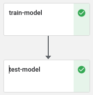

# Kubeflow pipeline demo
Kubeflow pipeline demo for MLOps purposes.
This project contains components _(see photo below)_ to preprocess data for ML model,
train ML model and testing/using the model to predict. Each component is
separate Docker instance that are build from the recent code using Github workflow action.

Preprocessing component takes a dataset directly from sklearn and
splits the data to x and y, train and test parts. X_train and x_test are optimised for more accurate results.
Data partitions are saved using numpy to _/app_ directory. 
Train component loads the saved data through arguments given for the _ContainerOp_ and uses it to
train a model. Model is saved to the _/app_ directory as _model.plk_.
Testing components loads the saved data and model through the arguments
and gives the prediction and score for the prediction.

Pipeline is build with _kfp_ package which is Kubeflow Pipeline SDK API.
Creating each individual op implementation of a container image with _ContainerOp_. 
Images are pulled from Docker for each component. For each op the needed _arguments_ and
_file_outputs_ are defined on _pipeline.py_. Pipeline flow is defined in _kubeflow_demo_pipeline_ and 
the _pipeline.yaml_ file is compiled based on the _pipeline.py_ code.



### Code modifications

In case of code modifications to _pipeline.py_, run the code to generate new _pipeline.yaml_. **You need to install _kfp_ in your environment to compile the .py to .yaml file.**

If modifying the components, remember to push changes to Github to get newest version for the Docker images.

## Requirements

* [Kubernetes (with Minikube)](https://phoenixnap.com/kb/install-minikube-on-ubuntu)

* Kubeflow (kind / K3s / K3ai). Install one of those three is enough and I choose **kind** for myself because it helps to avoid many running errors. ```KIND IS REAL KIND```. 

## Installation steps for local Kubeflow Pipelines
Follow the steps in [Kubeflow Documentation, Local Deployment](https://www.kubeflow.org/docs/components/pipelines/installation/localcluster-deployment/) to install **kind** with the configuration variable on Linux:

- KIND_VERSION: v0.8.1

- YOUR_KIND_DIRECTORY: /usr/local/bin


## Deploying Kubeflow Pipelines
Following installation works for all environments (kind, K3s, K3ai).

Deploy the Kubeflow Pipelines
```shell
export PIPELINE_VERSION=1.7.1

kubectl apply -k "github.com/kubeflow/pipelines/manifests/kustomize/cluster-scoped-resources?ref=$PIPELINE_VERSION"

kubectl wait --for condition=established --timeout=60s crd/applications.app.k8s.io

kubectl apply -k "github.com/kubeflow/pipelines/manifests/kustomize/env/platform-agnostic-pns?ref=$PIPELINE_VERSION"
```

Verify that the UI is accessible by port forwarding it:
```shell
kubectl port-forward -n kubeflow svc/ml-pipeline-ui 8080:80
```

You should see this when port-forward is successful.

```
Forwarding from 127.0.0.1:8080 -> 3000
Forwarding from [::1]:8080 -> 3000
Handling connection for 8080
Handling connection for 8080
Handling connection for 8080
Handling connection for 8080
Handling connection for 8080
```

Now you can access the UI at [http:/localhost:8080/](http://localhost:8080/).
In any case of issues check installation guide above or ask for further assistance.


### Using the Kubeflow Pipelines UI

After opening the UI _(see below)_, click the _+ Upload pipeline_ to create new pipeline.


Set name, description and upload _pipeline.yaml_ file for the new pipeline and click _create_.


This will lead to summary view, click _+ Create run_ button from top of the window.
Run details contains everything needed for basic run, click _Start_.


Finally the run view will open and the pipeline is running. 
After run the results will be available on the side panel.
